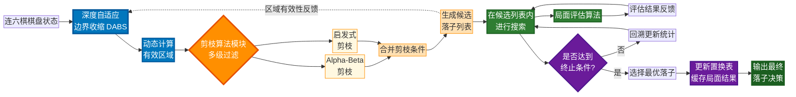

![[Pasted image 20260807093216.png]]
![[Pasted image 20260807093257.png]]
- 选题要求：
![[Pasted image 20260807112857.png]]
![[Pasted image 20260807112910.png]]

```mermaid
---
config:
  flowchart:
    curve: basis
    padding: 1
    nodeSpacing: 4
    rankSpacing: 30
    htmlLabels: true
  layout: fixed
---
flowchart LR
    A["连六棋棋盘状态"] --> C["深度自适应<br>边界收缩 DABS"]
    C --> C1["动态计算<br>有效区域"]
    C1 --> D{"剪枝算法模块<br>多级过滤"}
    D --> E["Alpha-Beta<br>剪枝"] & F["启发式<br>剪枝"]
    E --> H["合并剪枝条件"]
    F --> H
    H --> H1["生成候选<br>落子列表"]
    H1 --> I["在候选列表内<br>进行搜索"]
    I --> J["局面评估算法"] & L{"是否达到<br>终止条件?"}
    J --> K["评估结果反馈"]
    K --> I
    L -- 否 --> M["回溯更新统计"]
    M --> I
    L -- 是 --> N["选择最优落子"]
    N --> O["更新置换表<br>缓存局面结果"]
    O --> P["输出最终<br>落子决策"]
    H1 -. 区域有效性反馈 .-> C

    style C fill:#0277bd,stroke:#01579b,stroke-width:3px,color:#fff
    style C1 fill:#0277bd,stroke:#01579b,stroke-width:2px,color:#fff
    style D fill:#ff8f00,stroke:#e65100,stroke-width:3px,color:#fff
    style E fill:#fff8e1,stroke:#ff8f00
    style F fill:#fff8e1,stroke:#ff8f00
    style H fill:#ffe0b2,stroke:#ff8f00
    style H1 fill:#ffe0b2,stroke:#ff8f00
    style I fill:#2e7d32,stroke:#1b5e20,stroke-width:2px,color:#fff
    style J fill:#2e7d32,stroke:#1b5e20,stroke-width:2px,color:#fff
    style L fill:#6a1b9a,stroke:#4a148c,stroke-width:2px,color:#fff
    style O fill:#6a1b9a,stroke:#4a148c,stroke-width:2px,color:#fff
    style P fill:#1b5e20,stroke:#1b5e20,stroke-width:3px,color:#fff
```