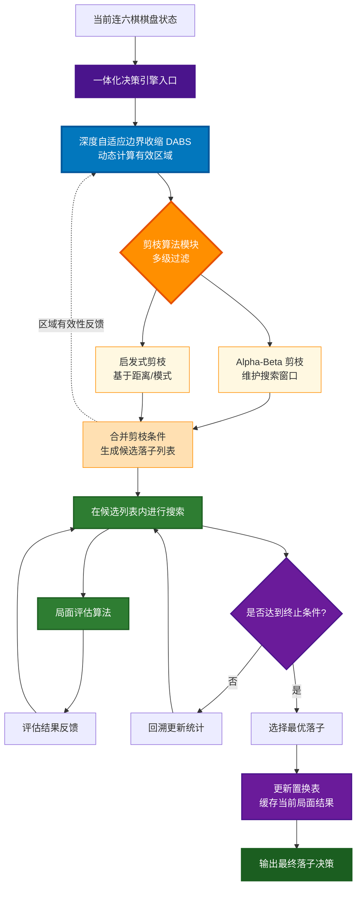

```mermaid
flowchart TD
    A[当前连六棋棋盘状态] --> B[一体化决策引擎入口]
    
    B --> C[深度自适应边界收缩 DABS<br>动态计算有效区域]
    
    C --> D{剪枝算法模块<br>多级过滤}
    
    D --> E[Alpha-Beta 剪枝<br>维护搜索窗口]
    D --> F[启发式剪枝<br>基于距离/模式]
    
    
    E & F  --> H[合并剪枝条件<br>生成候选落子列表]
    
    H --> I[在候选列表内进行搜索]
    
    I --> J[局面评估算法]
    
    J --> K[评估结果反馈]
    K --> I
    
    I --> L{是否达到终止条件?}
    L -->|否| M[回溯更新统计]
    M --> I
    
    L -->|是| N[选择最优落子]
    
    N --> O[更新置换表<br>缓存当前局面结果]
    O --> P[输出最终落子决策]
    
    %% 反馈回路: 剪枝结果反馈给DABS做动态调整
    H -.->|区域有效性反馈| C
    
    style B fill:#4a148c,stroke:#4a148c,stroke-width:3px,color:#fff
    style C fill:#0277bd,stroke:#01579b,stroke-width:3px,color:#fff
    style D fill:#ff8f00,stroke:#e65100,stroke-width:3px,color:#fff
    style I fill:#2e7d32,stroke:#1b5e20,stroke-width:2px,color:#fff
    style J fill:#2e7d32,stroke:#1b5e20,stroke-width:2px,color:#fff
    style L fill:#6a1b9a,stroke:#4a148c,stroke-width:2px,color:#fff
    style O fill:#6a1b9a,stroke:#4a148c,stroke-width:2px,color:#fff
    style P fill:#1b5e20,stroke:#1b5e20,stroke-width:3px,color:#fff
    
    style E fill:#fff8e1,stroke:#ff8f00
    style F fill:#fff8e1,stroke:#ff8f00
    style H fill:#ffe0b2,stroke:#ff8f00
```