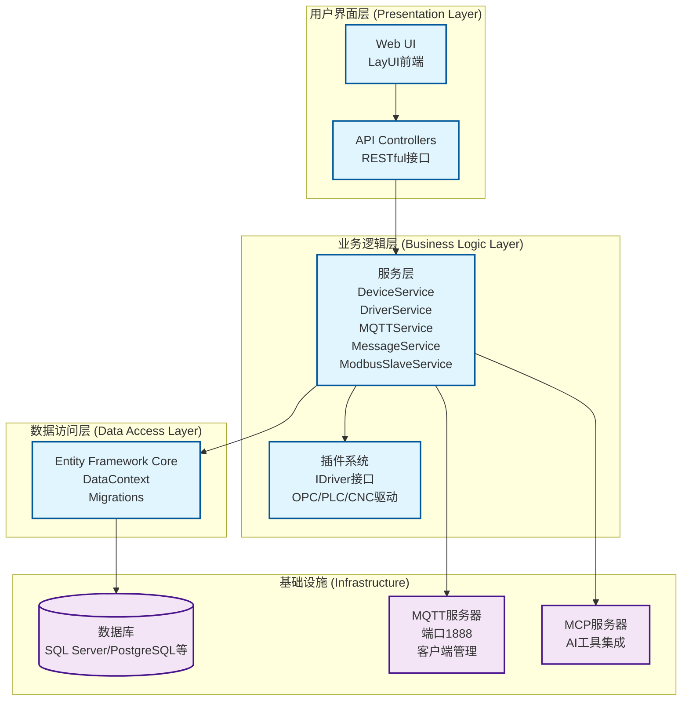

```mermaid
graph TB
    subgraph "用户界面层 (Presentation Layer)"
        UI[Web UI<br/>LayUI前端]
        API[API Controllers<br/>RESTful接口]
    end

    subgraph "业务逻辑层 (Business Logic Layer)"
        Services[服务层<br/>DeviceService<br/>DriverService<br/>MQTTService<br/>MessageService<br/>ModbusSlaveService]
        Plugins[插件系统<br/>IDriver接口<br/>OPC/PLC/CNC驱动]
    end

    subgraph "数据访问层 (Data Access Layer)"
        DAL[Entity Framework Core<br/>DataContext<br/>Migrations]
    end

    subgraph "基础设施 (Infrastructure)"
        MQTT[MQTT服务器<br/>端口1888<br/>客户端管理]
        DB[(数据库<br/>SQL Server/PostgreSQL等)]
        MCP[MCP服务器<br/>AI工具集成]
    end

    UI --> API
    API --> Services
    Services --> DAL
    Services --> Plugins
    Services --> MQTT
    DAL --> DB
    Services --> MCP

    classDef layer fill:#e1f5fe,stroke:#01579b,stroke-width:2px;
    classDef infra fill:#f3e5f5,stroke:#4a148c,stroke-width:2px;
    
    class UI,API layer;
    class Services,Plugins layer;
    class DAL layer;
    class MQTT,DB,MCP infra;
```